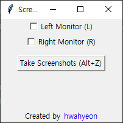

# Screenshot Splitter

- [English](#english)
- [한국어](#한국어)

## English
### Overview
This is a screenshot program designed for dual monitors.

### Download
[Download](https://github.com/hwahyeon/py-screenshot-spliter/raw/main/download/Screenshot%20Splitter.exe)

### How to use

- When you run the `Screenshot Splitter.exe`, the screen will appear like the picture above.
- When the file is executed, `screenshots` folder is created in the location of `Screenshot Splitter.exe`, and screenshots are saved there in chronological order.
- You can choose to take a screenshot of only one of the dual monitors or both. Please check the appropriate checkbox.
- Shortcut keys are provided.

### In Python
- Python 3.8
- mss 9.0.1
- screeninfo 0.8.1
- pillow 10.0.1

## 한국어
### 개요
듀얼 모니터용 스크린샷 프로그램입니다.

### 다운로드
[Download](https://github.com/hwahyeon/py-screenshot-splitter/raw/main/download/Screenshot%20Splitter.exe)

### 사용 방법

- `Screenshot Splitter.exe`를 실행하면 위 화면이 출력됩니다.
- 파일을 실행하면, `Screenshot Splitter.exe` 위치에 `screenshots` 폴더가 생성되고 이곳에 screenshot들이 시간 순으로 저장됩니다.
- 듀얼 모니터 중 선택한 쪽만 스크린샷할 수 있으며, 양쪽 다 스크린샷할 수 있습니다. 체크박스에서 원하는 곳에 체크하여 주십시오.
- 단축키가 제공됩니다.

### Python으로 직접 사용을 위한 라이브러리
- Python 3.8
- mss 9.0.1
- screeninfo 0.8.1
- pillow 10.0.1
